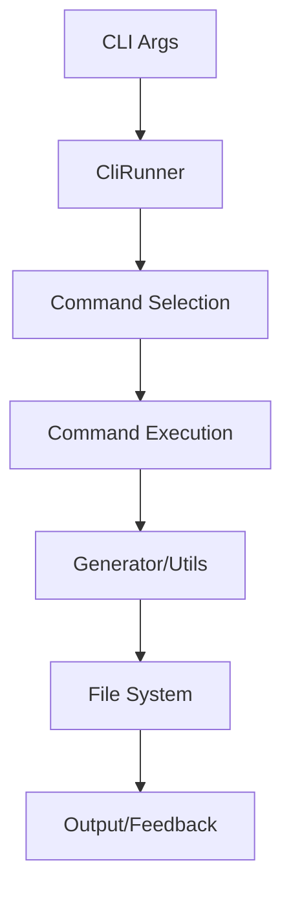

# Arquitectura y Decisiones Técnicas

## Visión General

Flutter Dev Toolkit está diseñado como una CLI modular y extensible que sigue principios de arquitectura limpia y patrones de diseño sólidos.

## Estructura del Proyecto

```
flutter_dev_toolkit/
├── bin/
│   └── flutter_dev_toolkit.dart        # Punto de entrada ejecutable
├── lib/
│   ├── flutter_dev_toolkit.dart        # API pública
│   └── src/                            # Implementación interna
│       ├── cli_runner.dart             # Orquestador principal
│       ├── commands/                   # Comandos CLI
│       │   ├── base_command.dart       # Comando base abstracto
│       │   ├── create_command.dart     # Generación de paquetes
│       │   ├── validate_command.dart   # Validación pub.dev
│       │   ├── guide_command.dart      # Guías interactivas
│       │   ├── example_command.dart    # Ejemplos de código
│       │   ├── template_command.dart   # Gestión de templates
│       │   └── init_command.dart       # Inicialización
│       ├── generators/                 # Generadores de código
│       │   └── package_generator.dart  # Generador principal
│       ├── utils/                      # Utilidades compartidas
│       │   ├── logger.dart            # Sistema de logging
│       │   ├── validator.dart         # Validaciones
│       │   └── file_utils.dart        # Operaciones de archivos
│       └── templates/                  # Templates y plantillas
├── docs/                              # Documentación completa
├── scripts/                           # Scripts de backup/referencia
└── test/                             # Tests unitarios
```

## Principios de Diseño

### 1. Separación de Responsabilidades
- **CLI Layer**: Manejo de argumentos y interfaz de usuario
- **Command Layer**: Lógica específica de cada comando
- **Generator Layer**: Generación de código y archivos
- **Utils Layer**: Funcionalidades compartidas y utilities

### 2. Extensibilidad
- Sistema de comandos pluggable
- Templates personalizables
- Generadores modulares

### 3. Testabilidad
- Inyección de dependencias
- Interfaces y abstracciones claras
- Mocking de operaciones de I/O

## Decisiones Arquitectónicas

### Command Pattern
**Problema**: Necesidad de agregar nuevos comandos sin modificar código existente
**Solución**: Patrón Command con base abstracta `BaseCommand`
**Beneficios**:
- Fácil extensión con nuevos comandos
- Consistencia en la interfaz
- Reutilización de funcionalidad común

```dart
abstract class BaseCommand extends Command<int> {
  @override
  FutureOr<int> run() async {
    try {
      await execute();
      return 0;
    } catch (e) {
      Logger.error('Error: $e');
      return 1;
    }
  }
  
  Future<void> execute();
}
```

### Template Strategy Pattern
**Problema**: Diferentes tipos de proyectos requieren diferentes estructuras
**Solución**: Strategy pattern para generación de templates
**Beneficios**:
- Flexibilidad en tipos de proyectos
- Reutilización de código común
- Fácil adición de nuevos tipos

### Dependency Injection
**Problema**: Acoplamiento fuerte entre componentes
**Solución**: Inyección manual de dependencias en constructores
**Beneficios**:
- Mejor testabilidad
- Flexibilidad en configuración
- Reducción de acoplamiento

## Flujo de Datos



## Patrones Implementados

### 1. Builder Pattern
Usado en `PackageOptions` para configuración flexible:

```dart
class PackageOptions {
  const PackageOptions({
    required this.name,
    required this.type,
    // ... otros parámetros
  });
}
```

### 2. Factory Pattern
En `PackageGenerator` para crear diferentes tipos de proyectos:

```dart
Future<void> generate(PackageOptions options) async {
  switch (options.type) {
    case 'app':
      await _generateFlutterApp(outputDir, options);
      break;
    case 'plugin':
      await _generateFlutterPlugin(outputDir, options);
      break;
    // ...
  }
}
```

### 3. Template Method Pattern
En `BaseCommand` para definir estructura común:

```dart
abstract class BaseCommand extends Command<int> {
  @override
  FutureOr<int> run() async {
    // Template method con pasos comunes
    try {
      await execute(); // Paso específico implementado por subclases
      return 0;
    } catch (e) {
      Logger.error('Error: $e');
      return 1;
    }
  }
}
```

## Gestión de Estado

### Inmutabilidad
- Objetos de configuración inmutables
- Estado de aplicación readonly
- Operaciones funcionales sin efectos secundarios

### Error Handling
- Excepciones tipadas por dominio
- Logging centralizado
- Rollback automático en caso de errores

## Decisiones de Implementación

### 1. ¿Por qué no usar código generado?
**Decisión**: Implementación manual en lugar de build_runner
**Razones**:
- Mayor control sobre la generación
- Menos dependencias externas
- Flexibilidad en templates
- Mejor debugging

### 2. ¿Por qué StringBuffer para templates?
**Decisión**: StringBuffer en lugar de concatenación de strings
**Razones**:
- Mejor performance con strings largos
- Formateo más claro
- Menos memory allocations

### 3. ¿Por qué validación custom?
**Decisión**: Sistema de validación propio vs usar pub.dev API
**Razones**:
- Control total sobre criterios
- Feedback inmediato sin network
- Consistencia con mejores prácticas

## Performance Considerations

### 1. Lazy Loading
- Carga de templates bajo demanda
- Inicialización diferida de comandos
- Caching de resultados costosos

### 2. Async/Await
- Operaciones de I/O no bloqueantes
- Procesamiento paralelo cuando es posible
- Timeouts apropiados

### 3. Memory Management
- Dispose de recursos
- Streaming para archivos grandes
- Evitar memory leaks en loops

## Testing Strategy

### 1. Unit Tests
- Tests para cada comando individualmente
- Mocking de file system operations
- Validación de templates generados

### 2. Integration Tests
- End-to-end testing de CLI
- Validación de paquetes generados
- Tests de regresión

### 3. Golden Tests
- Comparación de output esperado
- Validación de templates
- Detección de cambios no intencionados

## Extensibilidad

### Agregar Nuevo Comando

1. **Crear clase de comando**:
```dart
class NewCommand extends BaseCommand {
  @override
  String get description => 'Description of new command';
  
  @override
  String get name => 'new-command';
  
  @override
  Future<void> execute() async {
    // Implementation
  }
}
```

2. **Registrar en CliRunner**:
```dart
void _setupCommands() {
  addCommand(CreateCommand());
  addCommand(ValidateCommand());
  addCommand(NewCommand()); // Agregar aquí
}
```

### Agregar Nuevo Template

1. **Extender PackageGenerator**:
```dart
Future<void> _generateNewType(Directory outputDir, PackageOptions options) async {
  // Implementation
}
```

2. **Agregar al switch**:
```dart
switch (options.type) {
  case 'new-type':
    await _generateNewType(outputDir, options);
    break;
}
```

## Seguridad

### 1. File System Security
- Validación de paths de entrada
- Prevención de path traversal
- Permisos mínimos necesarios

### 2. Input Validation
- Sanitización de nombres de paquetes
- Validación de argumentos CLI
- Escape de contenido generado

### 3. Dependencies Security
- Dependencias mínimas
- Versiones pinned en pub.dev
- Auditoría regular de dependencias

## Monitoreo y Debugging

### 1. Logging Levels
```dart
Logger.verbose('Detailed debug info');
Logger.info('General information');
Logger.warning('Warning message');
Logger.error('Error occurred');
```

### 2. Debug Mode
- Flag `--verbose` para output detallado
- Stack traces completos en desarrollo
- Timing información para performance

### 3. Error Reporting
- Contexto completo en errores
- Sugerencias de solución
- Links a documentación relevante

## Roadmap Técnico

### v1.1
- [ ] Plugin system para comandos custom
- [ ] Configuration file support
- [ ] Template caching mechanism
- [ ] Performance profiling

### v1.2
- [ ] Web interface para generación
- [ ] API REST para integración
- [ ] Docker containerization
- [ ] CI/CD templates

### v2.0
- [ ] AI-powered code generation
- [ ] Visual template editor
- [ ] Real-time collaboration
- [ ] Cloud-based storage

## Contribución

### Code Style
- Seguir Dart style guide
- Documentar APIs públicas
- Usar análisis estático (lints)
- 100% cobertura de tests críticos

### Review Process
1. Fork y feature branch
2. Implementar con tests
3. Pasar CI/CD checks
4. Code review por maintainers
5. Merge a main branch

### Architecture Review
Para cambios arquitectónicos mayores:
1. RFC (Request for Comments)
2. Design document
3. Prototipo/POC
4. Community feedback
5. Implementation plan